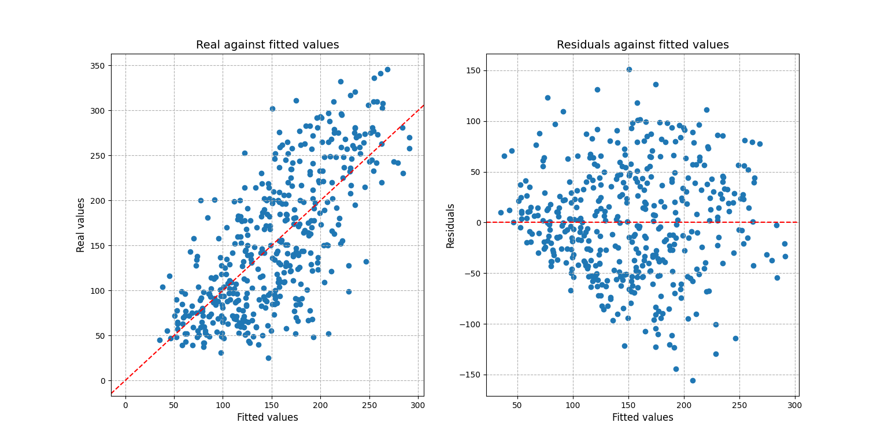
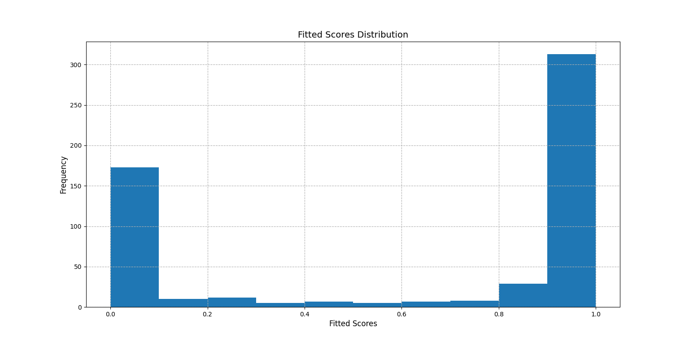
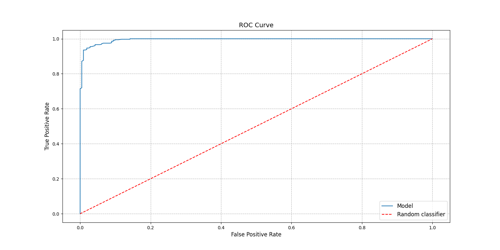
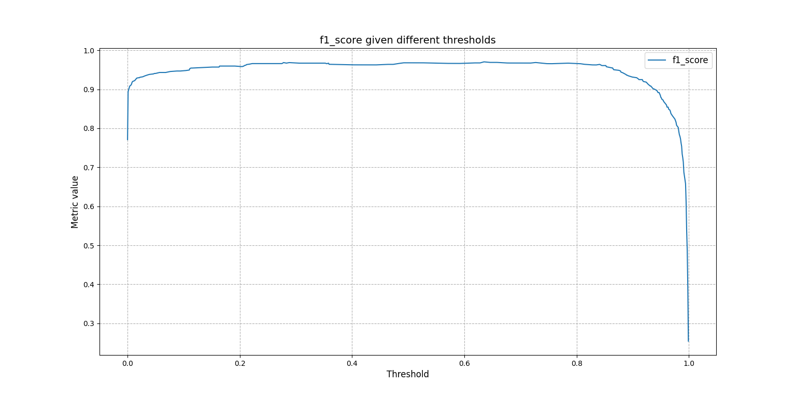

Quick Start
-----------

Installation
~~~~~~~~~~~~

You can install EasyPred via ``pip``

::

    pip install easypred

Alternatively, you can install EasyPred by cloning the project to your
local directory

::

    git clone https://github.com/FilippoPisello/EasyPred

And then run ``setup.py``

::

    python setup.py install

Requirements
~~~~~~~~~~~~~~~
EasyPred depends on the following libraries:

*  NumPy
*  pandas
*  matplotlib

Usage
~~~~~

The core of the library consists in its four prediction-like objects.

Three of them are proper representations of predictions:

* **Prediction**: any prediction
* **BinaryPrediction**: fitted and real data attain only two values
* **NumericPrediction**: fitted and real data are numeric

Then there is the case when observations are matched to a probability rather
than to an outcome:

* **BinaryScore**: prediction output that returns probability scores

Prediction
^^^^^^^^^^

Consider the example of a generic prediction over text categories:

.. code:: python

    >>> real_data = ["Foo", "Foo", "Bar", "Bar", "Baz"]
    >>> fitted_data = ["Baz", "Bar", "Foo", "Bar", "Bar"]

    >>> from easypred import Prediction
    >>> pred = Prediction(real_data, fitted_data)

Let's check the rate of correctly classified observations:

.. code:: python

    >>> pred.accuracy_score
    0.2

More detail is needed, let's investigate where predictions and real
match:

.. code:: python

    >>> pred.matches()
    array([False, False, False,  True, False])

Still not clear enough, display everything in a data frame:

.. code:: python

    >>> pred.as_dataframe()
      Real Values Fitted Values  Prediction Matches
    0         Foo           Baz               False
    1         Foo           Bar               False
    2         Bar           Foo               False
    3         Bar           Bar                True
    4         Baz           Bar               False

BinaryPrediction
^^^^^^^^^^^^^^^^

Consider the case of a classic binary context (note: the two values can
be any value, no need to be 0 and 1):

.. code:: python

    >>> real_data = [1, 1, 0, 0]
    >>> fitted_data = [0, 1, 0, 0]
    >>> from easypred import BinaryPrediction
    >>> bin_pred = BinaryPrediction(real_data, fitted_data, value_positive=1)

What are the false positive and false negative rates? What about
sensitivity and specificity?

.. code:: python

    >>> bin_pred.false_positive_rate
    0.0
    >>> bin_pred.false_negative_rate
    0.5
    >>> bin_pred.recall_score
    0.5
    >>> bin_pred.specificity_score
    1.0

Let's look now at the confusion matrix as a pandas data frame:

.. code:: python

    >>> bin_pred.confusion_matrix(as_dataframe=True)
            Pred 0  Pred 1
    Real 0       2       0
    Real 1       1       1

NumericPrediction
^^^^^^^^^^^^^^^^^

Let's look at the numeric use case:

.. code:: python

    >>> real_data = [1, 2, 3, 4, 5, 6, 7]
    >>> fitted_data = [1, 2, 4, 3, 7, 2, 5]
    >>> from easypred import NumericPrediction
    >>> num_pred = NumericPrediction(real_data, fitted_data)

We can access the residuals with various flavours, let's go for the
basic values:

.. code:: python

    >>> num_pred.residuals(squared=False, absolute=False, relative=False)
    array([ 0,  0, -1,  1, -2,  4,  2])

The data frame representation has now more information:

.. code:: python

    >>> num_pred.as_dataframe()
       Real Values  Fitted Values  Prediction Matches  Absolute Difference  Relative Difference
    0            1              1                True                    0             0.000000
    1            2              2                True                    0             0.000000
    2            3              4               False                   -1            -0.333333
    3            4              3               False                    1             0.250000
    4            5              7               False                   -2            -0.400000
    5            6              2               False                    4             0.666667
    6            7              5               False                    2             0.285714

There are then a number of dedicated error and accuracy metrics:

.. code:: python

    >>> num_pred.mae
    1.4285714285714286
    >>> num_pred.mse
    3.7142857142857144
    >>> num_pred.rmse
    1.927248223318863
    >>> num_pred.mape
    0.27653061224489794
    >>> num_pred.r_squared
    0.31250000000000017

For a more complex scenario one may be interested into visualizing the residuals and prediction fit:

.. code:: python

    # Setting up the example, creating the prediction
    >>> from sklearn import datasets, linear_model
    >>> diabetes_X, diabetes_y = datasets.load_diabetes(return_X_y=True)
    >>> regr = linear_model.LinearRegression()
    >>> regr.fit(diabetes_X, diabetes_y)
    LinearRegression()
    >>> diabetes_y_pred = regr.predict(diabetes_X)
    # Loading the prediction into easypred
    >>> from easypred import NumericPrediction
    >>> pred = NumericPrediction(diabetes_y, diabetes_y_pred)
    >>> pred.plot_fit_residuals()
    array([<AxesSubplot:title={'center':'Real against fitted values'},
        xlabel='Fitted values', ylabel='Real values'>,
        <AxesSubplot:title={'center':'Residuals against fitted values'},
        xlabel='Fitted values', ylabel='Residuals'>],
        dtype=object)
    >>> from matplotlib import pyplot as plt
    >>> plt.show()

BinaryScore
^^^^^^^^^^^^^^^^

BinaryScore is to be used when working with probability scores, generally assigned in a 0-1 interval displaying the likelihood of an observation "of being 1".

Here using one of Sklearn's datasets:

.. code:: python

    >>> from sklearn.datasets import load_breast_cancer
    >>> from sklearn.linear_model import LogisticRegression
    >>> X, y = load_breast_cancer(return_X_y=True)
    >>> clf = LogisticRegression(solver="liblinear", random_state=0).fit(X, y)
    >>> probs = clf.predict_proba(X)[:, 1]
    >>> from easypred import BinaryScore
    >>> score = BinaryScore(y, probs, value_positive=1)

First we visualize the distribution of the fitted scores:

.. code:: python

    >>> score.plot_score_histogram()
    <AxesSubplot:title={'center':'Fitted Scores Distribution'}, xlabel='Fitted Scores', ylabel='Frequency'>
    >>> from matplotlib import pyplot as plt
    >>> plt.show()

A key metric in this case is the AUC score:

.. code:: python

    >>> score.auc_score
    0.9947611119919667

To better understand the number the ROC curve can be plotted:

.. code:: python

    >>> score.plot_roc_curve()
    <AxesSubplot:title={'center':'ROC Curve'}, xlabel='False Positive Rate', ylabel='True Positive Rate'>
    >>> plt.show()

Or one may want to know how the F1 score changes as the threshold to tell 1s from 0s takes different values:

.. code:: python

    >>> score.f1_scores
    array([0.77105832, 0.89361702, 0.89924433, 0.90379747, ...])

The same array can be plotted for a visual understanding:

.. code:: python

    >>> from easypred.metrics import f1_score
    >>> score.plot_metric(f1_score)
    <AxesSubplot:title={'center':'f1_score given different thresholds'}, xlabel='Threshold', ylabel='Metric value'>
    >>> plt.show()

To get a summary:

.. code:: python

    >>> score.describe()
                            Value
    N                    569.000000
    Max fitted score       0.999996
    AUC score              0.994761
    Max accuracy           0.963093
    Thresh max accuracy    0.635000
    Max F1 score           0.970464
    Thresh max F1 score    0.635000
